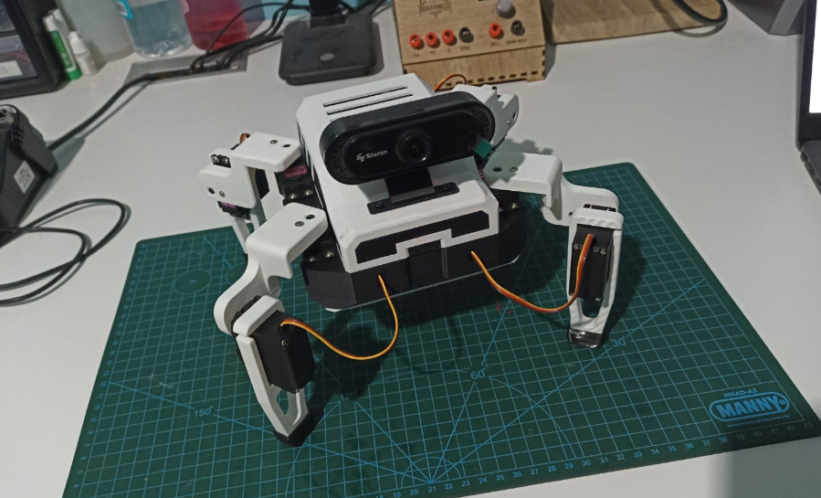
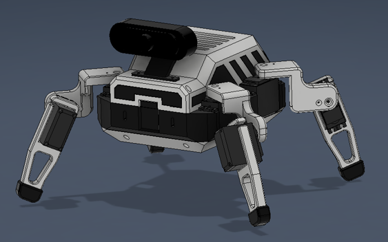
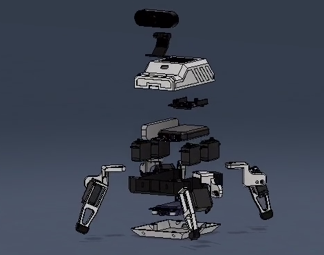
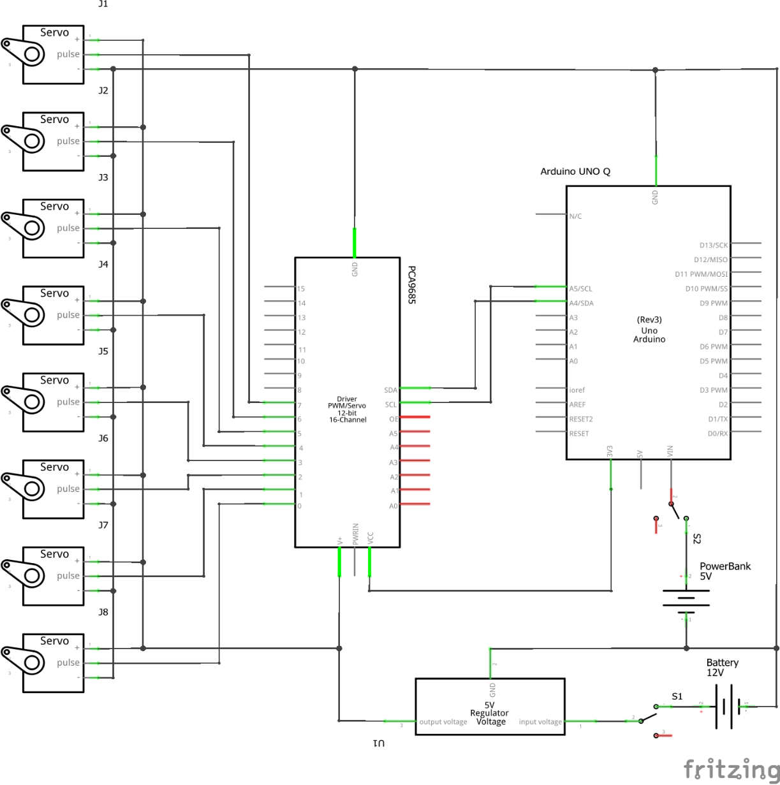
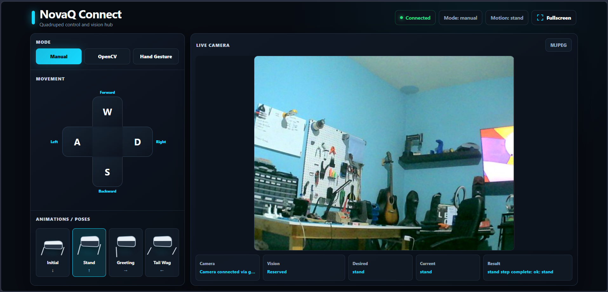
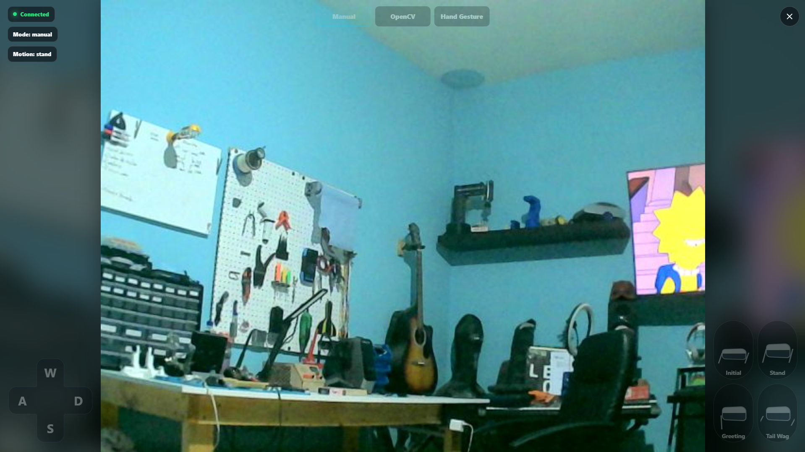
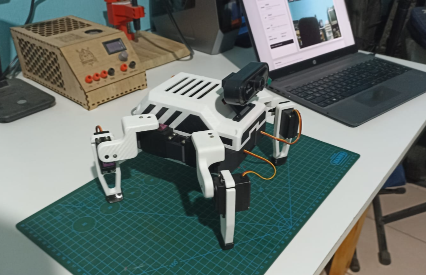

# NovaQ Quadruped Robot with Computer Vision

This repository documents and contains the files for a real quadruped robot built around an Arduino UNO Q. The project combines mechanical design, 3D printed parts, embedded motion control, a Python control layer, a web-based operator interface, and computer vision routines using OpenCV and Edge Impulse.

The robot has four legs with two degrees of freedom per leg. Eight MG996R servomotors are driven by a PCA9685 PWM controller, while the Arduino UNO Q separates high-level processing on its Linux side from low-level servo execution on its microcontroller side.

## Overview

The goal of the project is to build a functional robotics platform that can walk, turn, return to calibrated poses, show a greeting motion, stream camera video, track a blue ball, and respond to hand gestures.

```text
Web UI / ROG Ally
  -> Arduino App Lab on UNO Q Linux
  -> Python application
  -> Arduino Bridge
  -> UNO Q microcontroller sketch
  -> PCA9685 over I2C
  -> 8x MG996R servomotors
```



## Features

- Eight-servo quadruped platform with two degrees of freedom per leg.
- Manual Wi-Fi control through a browser-based web app.
- Live USB camera feedback for remote operation.
- OpenCV blue ball tracking mode.
- Edge Impulse hand gesture control mode.
- Motion routines for initial pose, stand, forward, backward, turns, and greeting.
- Smooth servo transitions using calibrated PCA9685 pulse values.
- 3D printed mechanical structure with printable STL files included in the repository.
- Separate power paths for logic and actuator stages.

## Mechanical Design

The mechanical structure was designed in Fusion 360 using the real dimensions of the main components: Arduino UNO Q, PCA9685 module, servomotors, battery, power bank, USB hub, camera, and internal wiring space. The design uses a central body, top case, base cover, camera mount, shoulders, legs, and feet.

Rigid parts were fabricated mainly in PLA. The feet were printed in TPU to improve floor contact and reduce slipping during gait tests. The repository includes STL files under `Design/STL/`, ready to slice and print.

The full mechanical design is also included for download and modification:

- `Design/Nova-Q.f3z`: editable Fusion 360 archive.
- `Design/Nova-Q.step`: neutral CAD export for other CAD tools.





## Electrical and Electronic Design

The robot uses an Arduino UNO Q as the main controller and a PCA9685 module to generate PWM signals for the eight MG996R servomotors. The PCA9685 communicates with the UNO Q through I2C and drives channels `0-7`.

The power design separates logic and actuator supply. The servo stage is powered from a 12 V Li-ion battery through a buck converter adjusted for the MG996R operating voltage. The logic/peripheral stage uses a 5 V power bank. A common ground must be shared between the UNO Q, PCA9685, and servo power supply.



Important electrical notes:

- Do not power the MG996R servos directly from the UNO Q.
- Verify buck converter output before connecting the servos.
- Keep grounds common across control and power stages.
- Use wiring sized appropriately for the current demanded by the servos.
- Keep a physical power switch or battery disconnect available during testing.

## Bill of Materials

| Component | Type | Operating Voltage | Signal / Control | Purpose |
| --- | --- | --- | --- | --- |
| 8x MG996R servomotors | Actuator | 4.8-7.2 V | PWM | High-torque joints for legs |
| PCA9685 module | PWM controller | 3.3-5 V logic | I2C | 16-channel, 12-bit PWM generation |
| 12 V Li-ion battery | Power source | 12 V | Power | Main actuator supply |
| Buck converter | Regulator | 12 V input / adjustable output | DC-DC | Servo voltage regulation |
| ON/OFF switch | Switch | According to supply | Mechanical switching | Main power control |
| 5 V power bank | Auxiliary power source | 5 V | USB | Logic and peripheral supply |
| Arduino UNO Q | Control board | 5 V input / 3.3 V logic | Digital / I2C / Bridge | Main control and processing unit |
| Anker USB-C hub | USB hub | 5 V / USB-C PD | USB | Camera and peripheral connection |
| Steren COM-122 webcam | Visual sensor | 5 V USB | USB video | Camera input for live view and vision modes |
| 3D printed PLA parts | Mechanical structure | N/A | N/A | Body, cover, shoulders, legs, and camera mount |
| TPU feet | Contact parts | N/A | N/A | Traction and floor contact |

## Software

The software is split into two layers:

- **Microcontroller layer**: the Arduino sketch receives motion commands and executes calibrated servo routines through the PCA9685.
- **Linux/Python layer**: the Python app serves the web interface, handles camera capture, runs OpenCV logic, receives Edge Impulse results, and sends high-level commands through Arduino Bridge.

The repository also includes a dedicated servo calibration web app in `Dev/Tools/uno-q-servo-calibrator`. This tool is used to test individual servos and adjust pulse values before running the full quadruped motion routines.

Main software tools and libraries:

- Arduino App Lab
- Arduino Bridge / RPC
- `Wire.h`
- `Adafruit_PWMServoDriver.h`
- Python
- OpenCV
- Edge Impulse
- HTML, CSS, and JavaScript

## Web App

The web app is the main operator interface. It provides manual movement controls, keyboard input, connection state, last executed action, camera feedback, and access to the OpenCV and Edge Impulse modes.




Common controls:

| Input | Action |
| --- | --- |
| Arrow Down | Initial position |
| Arrow Up | Stand |
| W | Move forward |
| S | Move backward |
| A | Turn left |
| D | Turn right |
| Arrow Right | Greeting |
| Space | Manual mode |
| Page Down | OpenCV mode |
| F4 | Hand gesture mode |
| Escape | Focus/camera view |

## Computer Vision

The project includes two vision-based modes:

- **OpenCV mode**: detects a blue ball using color masking and shape filtering. The robot can search, correct its orientation, and move forward depending on the ball position.
- **Edge Impulse mode**: recognizes hand gestures and maps them to movement commands such as forward, backward, turn, stand, or greeting.

The camera is also used for live video feedback during manual operation.

## Installation

1. Clone the repository.

   ```bash
   git clone https://github.com/<user>/<repository>.git
   cd <repository>
   ```

2. Open the main Arduino App Lab project:

   ```text
   Dev/uno-q-control-station
   ```

3. Install or verify the sketch dependencies listed in:

   ```text
   Dev/uno-q-control-station/sketch/sketch.yaml
   ```

4. Install Python dependencies:

   ```bash
   pip install -r Dev/uno-q-control-station/python/requirements.txt
   ```

5. Calibrate the servos if needed using:

   ```text
   Dev/Tools/uno-q-servo-calibrator
   ```

6. Connect the UNO Q, PCA9685, servos, camera, power bank, battery, buck converter, and common ground.

7. Start the app from Arduino App Lab.

8. Open the control interface:

   ```text
   http://<UNO_Q_IP>:7000
   ```

## Usage

Before running gait routines, test the robot with the servo power disconnected and verify that the web app loads correctly. Then power the servos with the robot lifted off the table and test initial and stand positions first.

Recommended startup sequence:

1. Check wiring, polarity, and buck converter voltage.
2. Power the logic side and start the App Lab project.
3. Confirm the web app and camera feed work.
4. Connect servo power with the robot lifted.
5. Run `initial` and `stand`.
6. Test forward, backward, turn, and greeting routines.
7. Test OpenCV and Edge Impulse modes only after manual motion is stable.



## Project Structure

```text
.
+-- Assets/
|   +-- Fusion_design.png
|   +-- NovaQ-schematic.png
|   +-- Physical1.png
|   +-- Physical2.png
|   +-- Nova_Q_exploded.mp4
+-- Design/
|   +-- Nova-Q.f3z
|   +-- Nova-Q.step
|   +-- STL/
|       +-- Base.stl
|       +-- Case.stl
|       +-- Camera_base.stl
|       +-- Leg*.stl
|       +-- Shoulder*.stl
|       +-- Foot*.stl
+-- Dev/
|   +-- uno-q-control-station/
|   |   +-- assets/
|   |   +-- python/
|   |   +-- sketch/
|   |   +-- app.yaml
|   +-- uno-q-keyboard-motion/
|   +-- Tools/
|       +-- uno-q-servo-calibrator/
+-- docs/
|   +-- images/
+-- README.md
```

## Notes

- The STL files in `Design/STL/` are included as printable mechanical parts. The editable Fusion 360 archive and STEP export are available in `Design/`.
- Servo pulse values depend on physical assembly and calibration. Recalibrate if servos, mounts, or linkages are changed.
- If additional external CAD files, trained models, or third-party assets are added later, their source and license should be documented in this README.
- The repository focuses on the complete robot implementation: electronics, firmware, Python software, web interface, mechanical integration, printable files, and documentation.

## License

This project is licensed under the GNU General Public License v3.0.
